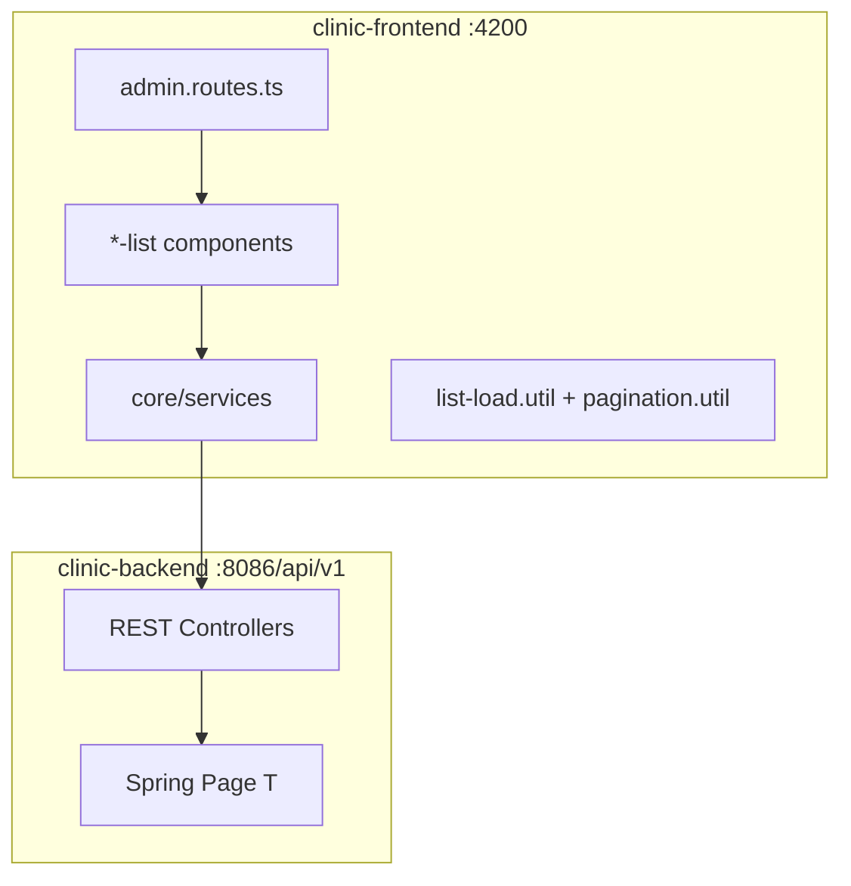

# توثيق التكامل البرمجي — نظام العيادة (Code Integration)

**الإصدار:** 1.0 · **2026-06-28**  
**Skill:** `rms-property-list-integration` + `estate-card-system`

---

## 1. Architecture Overview



---

## 2. List Page Contract (Property parity)

| Layer | Pattern |
|-------|---------|
| Shell | `page-shell` + `app-page-header` |
| Loading | `ListLoadController` — initial spinner vs `is-refreshing` |
| Empty | `app-empty-state` (no inline `<p>`) |
| Stats | `stat-pill` from `totalElements` |
| Table | `estate-card directory-table-card` + `estate-table-toolbar` |
| Pager | `app-table-pager` ↔ `PagedResponse.totalElements` |
| Search | Server `?q=` — never client filter on paged data |
| Dates | `rmsDate` pipe |

**Reference:** `Property_Managments/property-frontend/.../contract-list/`

---

## 3. Shared Files

| File | Role |
|------|------|
| `shared/utils/list-load.util.ts` | Soft refresh controller |
| `core/utils/pagination.util.ts` | `withPageParams()` |
| `shared/components/empty-state/` | Empty list UI |
| `shared/components/table-pager/` | Server pager |
| `styles/clinic-estate-cards.scss` | Estate card SCSS |

---

## 4. Route ↔ API Matrix (Lists)

| Route | Component | API | Filters |
|-------|-----------|-----|---------|
| `/admin/patients` | patient-list | `GET /patients` | q, active |
| `/admin/appointments` | appointment-list | `GET /appointments` | q, status |
| `/admin/billing` | billing-list | `GET /billing/invoices` | q, status |
| `/admin/billing/payments` | payment-list | `GET /billing/payments` | q |
| `/admin/users` | user-list | `GET /users` | q, role |
| `/admin/audit-logs` | audit-log-list | `GET /audit-logs` | q |
| `/admin/prescription` | prescription-list | `GET /prescriptions` | patientName in response |

---

## 5. Response Shape

```typescript
interface PagedResponse<T> {
  content: T[];
  totalElements: number;
  totalPages: number;
  number: number;
  size: number;
}
```

Backend: `ApiResponse<Page<T>>` — Spring Boot 3.2.

---

## 6. Smoke Test

**Script:** `clinic-frontend/scripts/api-integration-test.mjs`  
**Run:** `npm run test:api` (backend required)  
**Login:** `admin` / `Dev@Local2026!`  
**Result:** 26/26 (2026-06-28)

---

## 7. Regression Checklist

- [ ] No `filteredRows` on server-paged lists
- [ ] stat-pill uses `totalElements`, not `rows.length` only
- [ ] `ListLoadController` on high-traffic lists
- [ ] Audit search via `?q=` not client filter
- [ ] Smoke paths match controllers (`/dashboard/stats`, `/notifications/my/unread-count`)
- [ ] `ng build` passes

---

## 8. Related Docs

| Doc | Path |
|-----|------|
| Business gaps | `docs/business-gaps-ar.md` |
| User stories | `docs/user-stories-full-system-ar.md` |
| Test results | `docs/user-stories-test-results-ar.md` |
| Business spec | `docs/BUSINESS-SPEC-ar.md` |
